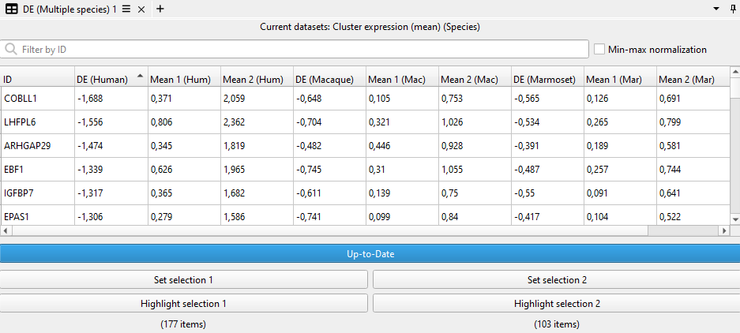

# DE Multi-Species Viewer

View plugin for the [ManiVault Studio](https://github.com/ManiVaultStudio/core) framework for a basic comparison of genetic expression levels between selections (differential expression) for multiple species.
Forked from [ManiVaultStudio/DifferentialExpressionPlugin](https://github.com/ManiVaultStudio/DifferentialExpressionPlugin).

```bash
git clone https://github.com/ManiVaultStudio/DE-MultiSpecies.git
```

This plugin captures variability between user-selected subsets by comparing the difference between expression averages per dimension. It computes the mean expression of all items (e.g. cells) in a selection and defines the differential expression as the difference of the means.

<p align="middle">
    
</p>

Information on more in-depth differential expression techniques can be found in many places, e.g. in _Differential gene expression analysis pipelines and bioinformatic tools for the identification of specific biomarkers: A review_ (2024, [10.1016/j.csbj.2024.02.018](https://doi.org/10.1016/j.csbj.2024.02.018)).

## How to use

1. Load a point data set, either via right-click in the data hierarchy and selecting `View -> DE (Multiple species)`, by or opening an empty widget via the main toolbar with `View -> DE (Multiple species)` and then dragging-and-dropping the data into the small field that ask for a dataset.
2. Drag a cluster item from the data hierarchy into the small field. The clusters must contain the indices of each species and cover all point data IDs.
    - You can define a data set that contains a selection mapping via the right-click context menu if the cluster IDs do not map surjectively to the points. You need to do this before dragging-in the cluster data.
3. Make two selection in the data, e.g. via a [scatterplot](https://github.com/ManiVaultStudio/Scatterplot) view. Save each selection by clicking the respective buttons at the bottom of the view.
4. Click the button above the selection-setters to compute the differential expression.
5. The resulting DE computation will be listed in table form, with one row for each dimension of the data (listed in the `ID` column).
6. You can now sort the table along each column or use the search bar to filter the dimension names.

The "Min-max normalization" option scales both mean (and median) of each selection values with `(selection_mean - global_min) / (global_max - global_min)`. The `global_*` values are computed for all data points, also those not selected.
