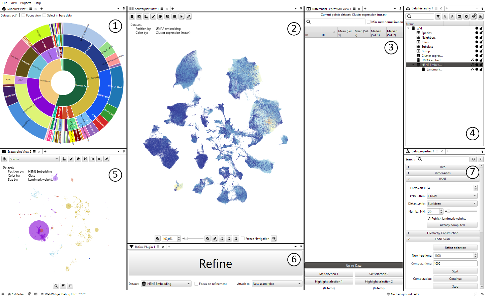
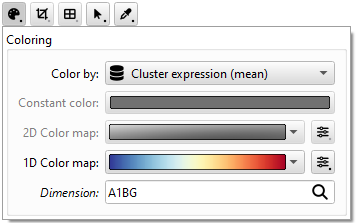
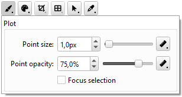

# Tutorial: Drill-in & re-embedding viewer

This project let's you explore the [HMBA basal ganglia consensus taxonomy](https://alleninstitute.github.io/HMBA_BasalGanglia_Consensus_Taxonomy/) annotated onto human, macaque and marmoset 10X multiome (RNA-seq)<sup>[1](#footnotes)</sup> [[1](https://en.wikipedia.org/wiki/RNA-Seq), [2](https://doi.org/10.1038/s12276-018-0071-8)] profiling. It contains human, macaque and marmoset data. For each species, single-cell variational inference (scVI) [[3](https://doi.org/10.1038/s41592-018-0229-2), [4](https://doi.org/10.1038/s41592-021-01336-8)] values map the respective RNA-seq expressions into a common reference frame. Pre-computed UMAP [[5](https://arxiv.org/abs/1802.03426)] and HSNE [[6](https://doi.org/10.1111/cgf.12878)] are provided. This tutorial will walk you through the main means of interaction with the data, like mapping selections, computing differential expressions, refining HSNE scales and recomputing UMAPs on subsets of the data.

## Overview

1. A [`sunburst`](https://en.wikipedia.org/wiki/Pie_chart#Ring) plot showing the hierarchical cell type taxonomy for categories that are consistent across species: `Neighbors`, `Class`, `Subclass`, `Group`
2. A pre-computed `UMAP embedding` of the `scVI` values from all three species, recolored by `Cluster expressions (mean)`
3. A table of differential expressions for all genes computed on `Cluster expressions (mean)` (empty at the start)
4. The hierarchy of all data in this project, see [below: _Data hierarchy_
](#data-hierarchy)
5. A pre-computed `HSNE embedding` of the `scVI` values from all three species, recolored by `Class` colors
6. A large button that will refine a selection in the `HSNE embedding`
7. An information panel for the currently selected dataset or analysis in the data hierarchy

<p align="middle">
    
</p>

### Data hierarchy

- `scVI`: single-cell variational inference values for human, macaque and marmoset RNA-seq data, 1'896'133 cells, 64 dimensions
    - `Species`: Clusters of species: human (1'034'819), macaque (548'281) and marmoset (313'033)
    - `Neighbors`: Clusters of neighborhood taxonomy level for all three species (4)
    - `Class`: Clusters of class taxonomy level for all three species (12)
    - `Subclass`: Clusters of subclass taxonomy level for all three species (36)
    - `Group`: Clusters of group taxonomy level for all three species (61)
    - `Cluster expressions (mean)`: Mean RNA expression value across cluster (1'435) for all genes common to the three species (16'140)
    - `UMAP embedding`: Pre-computed UMAP embedding of the scVI values
    - `HSNE embedding`: Pre-computed HSNE embedding of the scVI values, highest abstraction level
        - `Landmark weights`: The weight of a HSNE landmark on an abstraction level indicates how many data-level items this landmark represents


### Scatterplot settings
<div>
    <div style="float: right; width: 45%; margin-left: 10px;">
        <div style="display: grid; grid-template-columns: 1fr; grid-template-rows: auto auto; gap: 5px;">
            <!-- Top image (full width) -->
            
            <!-- Bottom row with two images side by side -->
            <div style="display: grid; grid-template-columns: 1fr 1fr; gap: 2px;">
                
                
            </div>
        </div>
    </div>
    <p>
        The scatterplot can resize and recolor each point based on user-adjustments or metadata. We can adjust these settings via the toolbar above the actual plot. This toolbar might expand some of it's button depending on available screen size, see e.g. the x- and y- axis labels in the screenshot on the right compared to the overview screenshot above.
        <br>
        The most important settings are accessible via the "Coloring" and "Plot" pop-ups. For the UMAP embedding in (2) we can see which gene (dimension) from the  <code>Cluster expressions (mean)</code> dataset is used for the recoloring.
    </p>
</div>


## Interactions
The main goal of this viewer is to provide several means of interactively exploration and "zooming into the data".

### Selections
It is possible to select:
- fixed collections of cells, by selecting items from the taxonomy hierarchy via the `sunburst` plot or the `data hierarchy`
    - holding `shift` while clicking adds/removes items to the current collections 
- free-form collections of cells via the scatterplots
    - the selection mode can be changed from the default rectangular to e.g., a lasso or brush

<p align="middle">
    
</p>

### Zooming
In the...
- scatterplots: `Alt` + `mousewheel` for zooming and `Alt` + `left mouse click` for panning
- sunburst plot: 
    - Full view: `mousewheel` for zooming and `left mouse click` for panning
    - Focus view: `left mouse click` on an item for zooming into subtree and `left mouse click` in the center to zoom-out one level

<p align="middle">
    
</p>

### Differential expression
It is interesting to capture variability between subsets of the data by comparing the difference between gene expression averages. In this project, we compute this differential expression (DE) as the difference of the means of all items (e.g. cells) in two selections.<sup>[2](#footnotes)</sup> To keep this project's size manageable, we do not use the gene expressions of all cells, but use mean expressions of a cell's respective cluster (from the taxonomy hierarchy).<sup>[3](#footnotes)</sup>

1. Make two selection, e.g., individual cells via the UMAP or HSNE, or (multiple) clusters via the sunburst plot. Save each selection by clicking the respective buttons at the bottom of the view.
2. Click the button above the selection-setters to compute the differential expression.
3. The resulting DE computation will be listed in table form, with one row for each dimension of the data (listed in the `ID` column).
4. You can now sort the table along each column or use the search bar to filter the dimension names.

The "Min-max normalization" option scales both mean (and median) of each selection values with `(selection_mean - global_min) / (global_max - global_min)`. The `global_*` values are computed for all data points, also those not selected.

> Note: the screen captures in this tutorial show the DE computation for all species combined, but the in the current project you'll see a distinction between the species.

<p align="middle">
    
</p>

### Drill-in
Refining selections of the top-level HSNE [[6](https://doi.org/10.1111/cgf.12878)] embedding (lower left) allows you to see more data structure for a subset of the data.

1. Select a subset of cells, e.g. via the taxonomy hierarchy of in a UMAP of HSNE embedding
2. Click the `Refine` button to drill into this selection
3. A refined embedding will open in a new scatterplot
4. Drag and drop meta data, e.g. `subclass` clusters, on the refined embedding

You can refine HSNE embedding down to the data level. This project starts with a 4-level HSNE hierarchy (one data and three abstraction levels), i.e. you can drill-in three times until reaching the data level.

The `Refine` button widget provides further settings for the source of the refinement: If you want to further drill into a refinement, select it as the "Dataset" in the drop-down option below the button.

<p align="middle">
    
</p>

### Re-embed
You can compute new UMAP, HSNE, t-SNE or PCA embeddings on either the full data or subsets of the full data in this project. A right-click on an item in the data hierarchy will open a context menu with an `Analyze` entry. Therein, you'll find all available re-embedding options for the respective specific data. Selecting any method will open a settings panel in the `Data properties` widget, showing method-specific options and buttons to start or stop computations.

For example, we might want to compute a new UMAP of just the marmoset-specific scVI values:
1. Create a subset of the `scVI` by
    - Selecting the marmoset cluster in the `Species` cluster data
    - Subsetting the `scVI` data based on this selection via the scatterplot toolbar
2. Open a new UMAP analysis via the context menu of the new `Marmoset scVI` data
3. Adjust settings (optional) and start the computation
4. Drag and drop the new embedding - which appears as a child to the `Marmoset scVI` data in the data hierarchy - onto a scatterplot, or open it in a new scatterplot via the context-menu.

<p align="middle">
    
</p>


## References 
1. [Wikipedia on RNA-Seq](https://en.wikipedia.org/wiki/RNA-Seq)
2. Hwang, B., Lee, J.H. & Bang, D. Single-cell RNA sequencing technologies and bioinformatics pipelines. Exp Mol Med 50, 1–14 (2018). https://doi.org/10.1038/s12276-018-0071-8
3. Lopez, R., Regier, J., Cole, M.B. et al. Deep generative modeling for single-cell transcriptomics. Nat Methods 15, 1053–1058 (2018). https://doi.org/10.1038/s41592-018-0229-2
4. Luecken, M.D., Büttner, M., Chaichoompu, K. et al. Benchmarking atlas-level data integration in single-cell genomics. Nat Methods 19, 41–50 (2022). https://doi.org/10.1038/s41592-021-01336-8
5. McInnes, L., Healy, J., Melville, J., UMAP: Uniform Manifold Approximation and Projection for Dimension Reduction. (2020). https://arxiv.org/abs/1802.03426
6. Pezzotti, N., Höllt, T., Lelieveldt, B., Eisemann, E. and Vilanova, A., Hierarchical Stochastic Neighbor Embedding. Computer Graphics Forum, 35: 21-30 (2016). https://doi.org/10.1111/cgf.12878

The data in this project is populated automatically and reproducibly via a [Jupyter notebook](https://github.com/ManiVaultStudio/JupyterPlugin/blob/release/core_bican_bg/bican_bg/examples/projects/basal_ganglia/load_basal_ganglia_data.ipynb). All data are retrieved from public sources.

## Footnotes
1. While [10x Multiome](https://www.scdiscoveries.com/services/10x-genomics/) captures the transcriptome via single-cell RNA sequencing (scRNA-seq) and chromatin accessibility profiles single-cell ATAC-seq (scATAC-seq) this project only uses the RNA expressions.
2. Information on more in-depth differential expression techniques can be found in many places, e.g. in _Differential gene expression analysis pipelines and bioinformatic tools for the identification of specific biomarkers: A review_ (2024, [10.1016/j.csbj.2024.02.018](https://doi.org/10.1016/j.csbj.2024.02.018)).
3. Using all gene expressions and not just accumulated cluster means is possible in this project, but only for individual genes and requires some local preprocessing. As the full data is rather large, loading all gene expressions for all cells and interacting in this project would not be feasible on most desktop machines. Expand the following detail section for more info.

<details closed>
   
<summary>How to use all expressions for individual genes </summary>
<div>
    <div style="float: right; width: 40%; margin-left: 10px;">
        
    </div>
    <p>
        You will need to download the full gene expression of the three species and combine them into a single h5 file. The Python script below does this automatically. Note that this will require a LOT of disk space and memory. 
        <br>
        After merging the sparse gene expression matrices into a single matrix stored in an H5 file, we can access single genes via the <code>Sparse H5 Access</code> plugin.
        <br>
        - Open the context-menu of the <code>scVI</code> data, and open the access plugin from the <code>Analysis</code> entry. This appends a new dataset to the hierarchy
        <br>
        - Initially, only a single gene is accessed. You can add more genes and change each one individually them.
        <br> 
        - To perform DE on this subset of genes, drag and drop the <code>Sparse data access</code> item from the data hierarchy onto the title row of the differential expression view where it says "Current points dataset:".
    </p>
</div>


<details closed>
<summary>Python script to download and merge all data </summary>

```python
"""
Downloads Mammalian Basal Ganglia Consensus Cell Type Atlas data
and merges all gene expression features of genes shared across
the three species human, mouse and marmoset into a single h5 file.

NOTE:
    This script will download ~160GB
    This script requires a lot of memory, 64GB is NOT enough
    Downloaded files and merged file will be placed next to this script
    The merged fill will be roughly ~75GB large

Alexander Vieth
2025
"""
from pathlib import Path
import anndata as ad
import functools as fct
import numpy as np
import h5py
from scipy import sparse as sp

def fetch_data(download_url : str, download_file_name : Path) -> None:
    from urllib.request import urlopen
    from urllib.error import HTTPError, URLError
    import ssl
    import shutil

    if not download_url.startswith("https://"):
        raise ValueError("Only HTTPS URLs are allowed.")

    if download_file_name.exists():
        print(f"Using existing file at: {download_file_name.resolve()}")
        return

    # Ensure parent directory exists
    download_file_name.parent.mkdir(parents=True, exist_ok=True)

    try:
        print(f"Downloading file to: {download_file_name.resolve()}")

        context = ssl.create_default_context()

        # Download the file from `url` and save it locally under `file_name`:
        with urlopen(download_url, context=context, timeout=10) as response, download_file_name.open('wb') as download_out_file:
            shutil.copyfileobj(response, download_out_file)

        print(f"Downloaded file to {download_file_name.resolve()}")
    except HTTPError as e:
        print(f"HTTP error: {e.code} - {e.reason}")
    except URLError as e:
        print(f"URL error: {e.reason}")
    except Exception as e:
        print(f"Unexpected error: {e}")

def save_h5(sparse_mat: sp.csr_matrix | sp.csc_matrix, filename: str | Path,
            storage_type: str, var_names = None, obs_names = None) -> None:
    """
    Save sparse matrices in CSC (Compressed Sparse Column) or CSR (Compressed Sparse Row) format to HDF5.
    """
    if storage_type.lower() == 'csr_matrix' and not isinstance(sparse_mat, sp.csr_matrix):
        raise TypeError('Data is not CSR.')
    if storage_type.lower() == 'csc_matrix' and not isinstance(sparse_mat, sp.csc_matrix):
        raise TypeError('Data is not CSC.')

    data_string_dt = h5py.string_dtype(encoding='utf-8')

    if not isinstance(filename, Path):
        filename = Path(filename)

    filename.parent.mkdir(parents=True, exist_ok=True)

    with h5py.File(filename, 'w') as f:
        group_x = f.create_group("X")

        group_x.attrs['encoding-type'] = storage_type
        group_x.attrs['encoding-version'] = "0.1.0"
        group_x.attrs['shape'] = sparse_mat.shape
        group_x.attrs['data-type'] = str(sparse_mat.data.dtype)
        group_x.attrs['indices-type'] = str(sparse_mat.indices.dtype)
        group_x.attrs['indptr-type'] = str(sparse_mat.indptr.dtype)

        group_x.create_dataset('data', data=sparse_mat.data)
        group_x.create_dataset('indices', data=sparse_mat.indices)  # row indices
        group_x.create_dataset('indptr', data=sparse_mat.indptr)  # column pointers

        # Optional metadata
        if obs_names is not None and len(obs_names) == sparse_mat.shape[0]:
            group_obs = f.create_group("obs")
            group_obs.create_dataset('_index', data=obs_names, dtype=data_string_dt)
        if var_names is not None and len(var_names) == sparse_mat.shape[1]:
            group_var = f.create_group("var")
            group_var.create_dataset('_index', data=var_names, dtype=data_string_dt)

def extract_column_from_csr(h5_file: h5py.File, extract_col_idx: int, extract_matrix_path: str = 'X') -> np.ndarray:
    # Access the csr matrix components
    matrix_group = h5_file[f'{extract_matrix_path}']

    assert matrix_group.attrs['encoding-type'] == 'csr_matrix'

    data = matrix_group['data']
    indices = matrix_group['indices']
    indptr = matrix_group['indptr']
    shape = matrix_group.attrs['shape']

    n_rows = shape[0]
    column_values = np.zeros(n_rows, dtype=data.dtype)

    # Process each row to find values in the target column
    for row_idx in range(n_rows):
        start_idx = indptr[row_idx]
        end_idx = indptr[row_idx + 1]

        # Get column indices for this row
        row_col_indices = indices[start_idx:end_idx]

        # Find if our target column is in this row
        col_mask = row_col_indices == extract_col_idx
        if np.any(col_mask):
            # Get the corresponding data values
            row_data = data[start_idx:end_idx]
            column_values[row_idx] = row_data[col_mask][0]  # Should be only one value

    return column_values

def extract_column_from_csc(h5_file: h5py.File, extract_col_idx: int, extract_matrix_path: str = "X") -> np.ndarray:
    matrix_group = h5_file[f"{extract_matrix_path}"]

    assert matrix_group.attrs["encoding-type"] == "csc_matrix"

    data = matrix_group["data"]
    indices = matrix_group["indices"]
    indptr = matrix_group["indptr"]
    shape = matrix_group.attrs["shape"]

    n_rows = shape[0]
    column_values = np.zeros(n_rows, dtype=data.dtype)

    # get the slice for this column
    start_idx = indptr[extract_col_idx]
    end_idx = indptr[extract_col_idx + 1]

    col_rows = indices[start_idx:end_idx]
    col_data = data[start_idx:end_idx]

    # fill values
    column_values[col_rows] = col_data

    return column_values

def get_matrix_info(h5_file: h5py.File, matrix_info_path: str = 'X') -> tuple[int, int, int]:
    """Get matrix dimensions from H5 file."""
    matrix_group = h5_file[f'{matrix_info_path}']
    shape = matrix_group.attrs['shape']
    nnz = matrix_group["data"].shape[0]
    return shape[0], shape[1], nnz

def combine_csr_to_csr(ann_dats: list[ad.AnnData], column_indices : list[np.ndarray]) -> sp.csr_matrix | None:
    assert all(x.shape == column_indices[0].shape for x in column_indices)

    num_files = len(ann_dats)
    print(f"Combine {num_files} files")

    # Get matrix dimensions
    shapes = [(ann_dat.n_obs, ann_dat.n_vars, len(ann_dat.X._data)) for ann_dat in ann_dats]

    n_cols_combined = column_indices[0].shape[0]
    n_rows_combined = sum(rows for rows, cols, nnz in shapes)

    for i in range(num_files):
        print(f"Matrix {i} shape: ({shapes[i][0]}, {shapes[i][1]}), nnz: {shapes[i][2]}")
    print(f"Combined shape: ({n_rows_combined}, {n_cols_combined})")

    print(f"Load {ann_dats[0].filename.name}")
    combined_matrix_csr = ann_dats[0].X.to_memory()[:, column_indices[0]]

    for i in range(1, num_files):
        print(f"Load {ann_dats[i].filename.name}")
        single_matrix = ann_dats[i].X.to_memory()
        combined_matrix_csr = sp.vstack([combined_matrix_csr, single_matrix[:, column_indices[i]]])
        del single_matrix

    print(f"Created CSR matrix with shape: {combined_matrix_csr.shape}")
    print(f"Number of non-zero elements: {combined_matrix_csr.nnz}")

    return combined_matrix_csr

if __name__ == "__main__":
    print(f"START: {__file__}")

    path_base = Path(__file__).parent.resolve()
    save_path = path_base / 'merged_all_csr.h5'

    # Remote data, see https://alleninstitute.github.io/HMBA_BasalGanglia_Consensus_Taxonomy/
    url_base = "https://released-taxonomies-802451596237-us-west-2.s3.us-west-2.amazonaws.com/HMBA/BasalGanglia"
    data_version = "BICAN_05072025_pre-print_release"

    HUMAN = 0
    MACAQ = 1
    MARMO = 2
    SPECIES = [HUMAN, MACAQ, MARMO]

    data_names = [""] * 3
    data_names[HUMAN] = "Human_HMBA_basalganglia_AIT_pre-print.h5ad"
    data_names[MACAQ] = "Macaque_HMBA_basalganglia_AIT_pre-print.h5ad"
    data_names[MARMO] = "Marmoset_HMBA_basalganglia_AIT_pre-print.h5ad"

    data_ait_urls = [f"{url_base}/{data_version}/{data_names[kind]}" for kind in SPECIES]
    data_ait_paths = [path_base / data_names[kind] for kind in SPECIES]

    print("Ensure data is available locally...")

    # Download data
    for kind in SPECIES:
        fetch_data(data_ait_urls[kind], data_ait_paths[kind])

    print("Data is available locally. Loading data...")

    # Load anndata [you'll need a good amount of RAM even though not all data is loaded to memory]
    d_ait = [ad.io.read_h5ad(data_ait_paths[kind], backed='r') for kind in SPECIES]

    # expected:
    # (1'034'819, 36'601)
    # (  548'281, 35'219)
    # (  313'033, 35'787)
    for kind in SPECIES:
        print(f"({d_ait[kind].n_obs:,}, {d_ait[kind].n_vars:,})".replace(",", "'").rjust(19))

    print("Finished loading data.")

    # Prep some meta data
    shared_var_names = fct.reduce(np.intersect1d, [d_ait[kind].var_names.to_numpy() for kind in SPECIES])
    shared_var_names = np.array(np.sort(shared_var_names), dtype=np.dtypes.StringDType())

    all_obs_names = np.concatenate([d_ait[kind].obs_names.to_numpy() for kind in SPECIES])
    shared_obs_names = fct.reduce(np.intersect1d, all_obs_names)

    assert len(shared_obs_names) == 0

    print(f"Compute indices")
    var_indices = [
        np.array([d_ait[kind].var_names.get_loc(var) for var in shared_var_names if var in d_ait[kind].var_names]) for
        kind in SPECIES]

    print(f"Merge to csr")

    merged_features_csr = combine_csr_to_csr(d_ait, var_indices)

    assert len(all_obs_names) == merged_features_csr.shape[0]

    print(f"Save merged features to {save_path}")
    save_h5(merged_features_csr, save_path, 'features_all_csr', shared_var_names, all_obs_names)

    print(f"FINISHED: {__file__}")

```

</details> 

</details>


